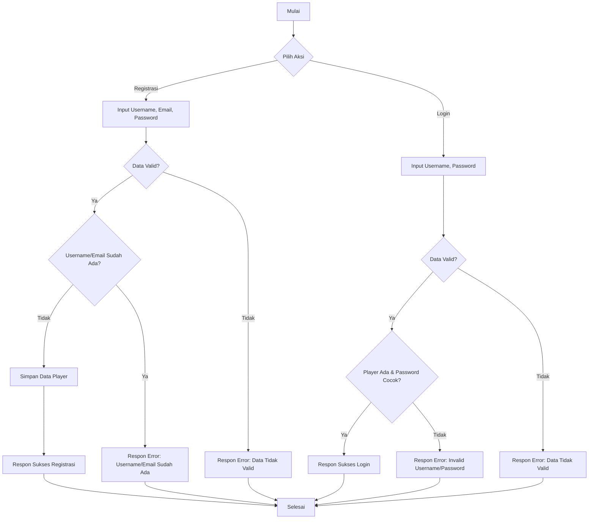
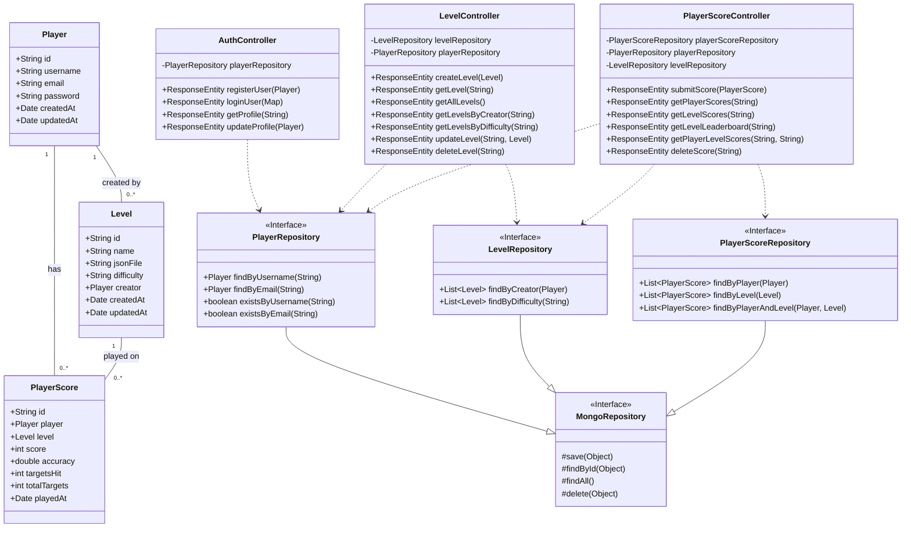
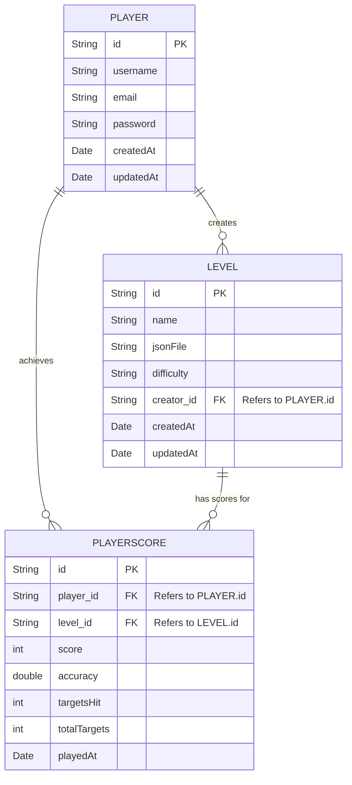

# Dokumentasi ReAim

## Daftar Isi

  - [ReAim](https://www.google.com/search?q=%23reaim)
      - [Daftar Isi](https://www.google.com/search?q=%23daftar-isi)
      - [Pendahuluan](https://www.google.com/search?q=%23pendahuluan)
      - [ReAim - Dokumentasi Backend](https://www.google.com/search?q=%23reaim---dokumentasi-backend)
          - [Teknologi yang Digunakan (Backend)](https://www.google.com/search?q=%23teknologi-yang-digunakan-backend)
          - [Struktur Proyek (ReAim-Springboot)](https://www.google.com/search?q=%23struktur-proyek-reaim-springboot)
          - [Konfigurasi (Backend)](https://www.google.com/search?q=%23konfigurasi-backend)
          - [Model Data (Backend)](https://www.google.com/search?q=%23model-data-backend)
              - [Player](https://www.google.com/search?q=%23player)
              - [Level](https://www.google.com/search?q=%23level)
              - [PlayerScore](https://www.google.com/search?q=%23playerscore)
          - [API Endpoints](https://www.google.com/search?q=%23api-endpoints)
              - [Autentikasi](https://www.google.com/search?q=%23autentikasi)
              - [Level](https://www.google.com/search?q=%23level-1)
              - [Skor Pemain](https://www.google.com/search?q=%23skor-pemain)
              - [Test](https://www.google.com/search?q=%23test)
          - [Diagram (Backend)](https://www.google.com/search?q=%23diagram-backend)
              - [Flowchart Registrasi & Login](https://www.google.com/search?q=%23flowchart-registrasi--login)
              - [UML Class Diagram](https://www.google.com/search?q=%23uml-class-diagram)
              - [ERD (Entity Relationship Diagram)](https://www.google.com/search?q=%23erd-entity-relationship-diagram)
          - [Menjalankan Aplikasi Backend](https://www.google.com/search?q=%23menjalankan-aplikasi-backend)
      - [ReAim - Dokumentasi Frontend](https://www.google.com/search?q=%23reaim---dokumentasi-frontend)
          - [Pendahuluan Singkat (Frontend)](https://www.google.com/search?q=%23pendahuluan-singkat-frontend)
          - [Teknologi yang Digunakan (Frontend)](https://www.google.com/search?q=%23teknologi-yang-digunakan-frontend)
          - [Struktur Proyek (ReAim-Frontend)](https://www.google.com/search?q=%23struktur-proyek-reaim-frontend)
          - [Komponen Utama (Frontend)](https://www.google.com/search?q=%23komponen-utama-frontend)
          - [Manajemen Aset (Frontend)](https://www.google.com/search?q=%23manajemen-aset-frontend)
          - [Alur Permainan (Frontend)](https://www.google.com/search?q=%23alur-permainan-frontend)
          - [Menjalankan Aplikasi Frontend](https://www.google.com/search?q=%23menjalankan-aplikasi-frontend)

-----

## Pendahuluan

Selamat datang di dokumentasi ReAim\! 🚀 ReAim adalah sebuah game yang dirancang untuk mengasah keterampilan membidik pemain. Dokumentasi ini akan memandu Anda memahami arsitektur dan fungsionalitas baik dari sisi **backend** maupun **frontend** aplikasi ReAim secara komprehensif. Backend mengelola data pemain, level, skor, dan autentikasi, sementara frontend menyediakan antarmuka visual dan interaksi game yang menarik.

-----

## ReAim - Dokumentasi Backend

### Teknologi yang Digunakan (Backend)

Backend ReAim dibangun dengan teknologi modern untuk performa dan skalabilitas:

  * **Java 17**: Bahasa pemrograman utama yang tangguh.
  * **Spring Boot 3.1.5**: Framework andal untuk membangun aplikasi microservice.
  * **Spring Data MongoDB**: Memudahkan interaksi dengan database NoSQL.
  * **MongoDB**: Database NoSQL fleksibel untuk penyimpanan data.
  * **Gradle**: Tool utama untuk manajemen dependensi dan proses build.
  * **Lombok**: Library yang sangat membantu mengurangi *boilerplate code* di Java.

### Struktur Proyek (ReAim-Springboot)

Berikut adalah gambaran singkat struktur proyek backend:

```
ReAim-Springboot
├── build/                 # Hasil build proyek Anda.
├── gradle/                # Konfigurasi Gradle Wrapper.
├── src
│   ├── main
│   │   ├── java
│   │   │   └── io/github/reaim
│   │   │       ├── ReAimApplication.java # Kelas utama Spring Boot, titik awal aplikasi.
│   │   │       ├── config              # Konfigurasi aplikasi, seperti MongoConfig.
│   │   │       ├── controller          # Pengendali API: AuthController, LevelController, PlayerScoreController, TestController.
│   │   │       ├── model               # Model data: Player, Level, PlayerScore.
│   │   │       └── repository          # Antarmuka untuk interaksi database: PlayerRepository, LevelRepository, PlayerScoreRepository.
│   │   └── resources
│   │       ├── application.properties  # Konfigurasi inti Spring Boot.
│   │       └── database
│   │           └── schema.sql          # (Tidak digunakan untuk MongoDB, bisa diabaikan).
│   └── test                            # Kode untuk pengujian unit dan integrasi.
├── .env                   # File untuk variabel lingkungan (misalnya, koneksi DB).
├── .gitignore             # File yang diabaikan oleh Git.
├── build.gradle           # Skrip build Gradle.
├── gradlew                # Gradle Wrapper (Linux/Mac).
└── gradlew.bat            # Gradle Wrapper (Windows).
```

### Konfigurasi (Backend)

Konfigurasi utama backend berada di file `src/main/resources/application.properties`. Pastikan Anda menyesuaikan pengaturan MongoDB di sini:

```properties
# Server Port
server.port=3000 # Port default adalah 8080, diubah menjadi 3000 untuk ReAim.

# MongoDB Configuration
spring.data.mongodb.uri=mongodb://localhost:27017/reaim_db # Ganti dengan URI MongoDB Anda!
# Anda juga bisa memisahkan host, port, dan database secara eksplisit:
# spring.data.mongodb.host=localhost
# spring.data.mongodb.port=27017
# spring.data.mongodb.database=reaim_db
```

**Penting:** Pastikan server MongoDB Anda berjalan dan dapat diakses sesuai dengan URI yang telah dikonfigurasi. Anda juga dapat memanfaatkan file `.env` untuk menyimpan konfigurasi sensitif dan memuatnya menggunakan library seperti `dotenv-java`.

### Model Data (Backend)

Berikut adalah entitas data utama yang digunakan di backend ReAim:

#### Player

Merepresentasikan informasi dasar pemain.

  * `id` (String): ID unik pemain (otomatis dari MongoDB).
  * `username` (String): Nama pengguna unik untuk login.
  * `email` (String): Alamat email unik pemain.
  * `password` (String): Kata sandi pemain (disarankan **sangat** untuk di-hash\!).
  * `createdAt` (Date): Tanggal dan waktu akun dibuat.
  * `updatedAt` (Date): Tanggal dan waktu terakhir akun diperbarui.

#### Level

Merepresentasikan detail setiap level permainan.

  * `id` (String): ID unik level (otomatis dari MongoDB).
  * `name` (String): Nama level yang ditampilkan di game.
  * `jsonFile` (String): Path atau URL ke file JSON yang berisi konfigurasi level (misalnya, posisi target, waktu).
  * `difficulty` (String): Tingkat kesulitan level (misalnya, "Mudah", "Sedang", "Sulit").
  * `creator` (Player): Pemain yang membuat atau mengunggah level ini (referensi ke model `Player`).
  * `createdAt` (Date): Tanggal dan waktu level dibuat.
  * `updatedAt` (Date): Tanggal dan waktu terakhir level diperbarui.

#### PlayerScore

Merepresentasikan skor yang dicapai pemain pada level tertentu.

  * `id` (String): ID unik skor (otomatis dari MongoDB).
  * `player` (Player): Pemain yang mencetak skor ini (referensi ke model `Player`).
  * `level` (Level): Level tempat skor ini dicapai (referensi ke model `Level`).
  * `score` (int): Total skor yang didapatkan.
  * `accuracy` (double): Tingkat akurasi tembakan (misalnya, 0.85 untuk 85%).
  * `targetsHit` (int): Jumlah target yang berhasil ditembak.
  * `totalTargets` (int): Jumlah total target yang ada di level.
  * `playedAt` (Date): Tanggal dan waktu skor ini dicapai.

### API Endpoints

Semua endpoint API ReAim menggunakan prefix `/api` dan berjalan pada port `3000` (default).

#### Autentikasi

Base URL: `/api/auth`

| Method | Endpoint              | Deskripsi                                 | Request Body (JSON)                                            | Response (JSON)                                                                |
|--------|-----------------------|-------------------------------------------|----------------------------------------------------------------|--------------------------------------------------------------------------------|
| `POST` | `/register`           | Mendaftarkan pemain baru.                 | `{ "username": "user", "email": "user@example.com", "password": "pass" }` | `{ "id": "...", "username": "...", ... }` atau pesan error                    |
| `POST` | `/login`              | Login pemain.                             | `{ "username": "user", "password": "pass" }`                   | `{ "message": "Login successful", "player": { ... } }` atau pesan error        |
| `GET`  | `/profile/{username}` | Mendapatkan profil pemain berdasarkan username. | -                                                              | `{ "id": "...", "username": "...", ... }` atau `404 Not Found`               |
| `PUT`  | `/profile/update`     | Memperbarui profil pemain (email/password). | `{ "id": "playerId", "email": "new@example.com", "password": "newpass" }` | `{ "id": "...", "username": "...", ... }` atau `404 Not Found` / pesan error |

#### Level

Base URL: `/api/levels`

| Method | Endpoint                   | Deskripsi                                   | Request Body (JSON)                                                                | Response (JSON)                                                               |
|--------|----------------------------|---------------------------------------------|------------------------------------------------------------------------------------|-------------------------------------------------------------------------------|
| `POST` | `/create`                  | Membuat level baru.                         | `{ "name": "Level 1", "jsonFile": "level1.json", "difficulty": "Mudah", "creator": {"id": "creatorPlayerId"} }` | `{ "id": "...", "name": "...", ... }` atau pesan error                       |
| `GET`  | `/`                        | Mendapatkan semua level.                    | -                                                                                  | `[ { "id": "...", "name": "...", ... }, ... ]`                               |
| `GET`  | `/{id}`                    | Mendapatkan detail level berdasarkan ID.    | -                                                                                  | `{ "id": "...", "name": "...", ... }` atau `404 Not Found`                  |
| `GET`  | `/creator/{creatorId}`     | Mendapatkan level berdasarkan ID pembuat.   | -                                                                                  | `[ { "id": "...", "name": "...", ... }, ... ]` atau `404 Not Found`         |
| `GET`  | `/difficulty/{difficulty}` | Mendapatkan level berdasarkan tingkat kesulitan. | -                                                                                  | `[ { "id": "...", "name": "...", ... }, ... ]`                               |
| `PUT`  | `/{id}`                    | Memperbarui detail level.                   | `{ "name": "Updated Name", "jsonFile": "updated.json", "difficulty": "Sedang" }` | `{ "id": "...", "name": "...", ... }` atau `404 Not Found` / pesan error    |
| `DELETE`| `/{id}`                    | Menghapus level.                            | -                                                                                  | `{ "message": "Level deleted successfully" }` atau `404 Not Found` / pesan error |

#### Skor Pemain

Base URL: `/api/scores`

| Method | Endpoint                             | Deskripsi                                       | Request Body (JSON)                                                                                                    | Response (JSON)                                                               |
|--------|--------------------------------------|-------------------------------------------------|------------------------------------------------------------------------------------------------------------------------|-------------------------------------------------------------------------------|
| `POST` | `/submit`                            | Mengirimkan skor baru.                          | `{ "player": {"id": "playerId"}, "level": {"id": "levelId"}, "score": 1500, "accuracy": 0.9, "targetsHit": 9, "totalTargets": 10 }` | `{ "id": "...", "player": {...}, ... }` atau pesan error                     |
| `GET`  | `/player/{playerId}`                 | Mendapatkan semua skor pemain berdasarkan ID pemain. | -                                                                                                                      | `[ { "id": "...", "score": ..., ... }, ... ]` atau `404 Not Found`         |
| `GET`  | `/level/{levelId}`                   | Mendapatkan semua skor untuk level tertentu.    | -                                                                                                                      | `[ { "id": "...", "score": ..., ... }, ... ]` atau `404 Not Found`         |
| `GET`  | `/leaderboard/{levelId}`             | Mendapatkan papan peringkat untuk level tertentu. | -                                                                                                                      | `[ { "id": "...", "score": ..., ... }, ... ]` (terurut berdasarkan skor tertinggi) |
| `GET`  | `/player/{playerId}/level/{levelId}` | Mendapatkan skor pemain untuk level tertentu.   | -                                                                                                                      | `[ { "id": "...", "score": ..., ... }, ... ]` atau `404 Not Found`         |
| `DELETE`| `/{id}`                              | Menghapus skor berdasarkan ID skor.             | -                                                                                                                      | `{ "message": "Score deleted successfully" }` atau `404 Not Found` / pesan error |

#### Test

Base URL: `/` (root)

| Method | Endpoint | Deskripsi                            | Request Body | Response          |
|--------|----------|--------------------------------------|--------------|-------------------|
| `GET`  | `/`      | Endpoint tes untuk mengecek server aktif. | -            | `"Test successful"` |

### Diagram (Backend)

#### Flowchart Registrasi & Login



#### UML Class Diagram



#### ERD (Entity Relationship Diagram)

Karena kami menggunakan MongoDB (database NoSQL), ERD tradisional dengan relasi kaku mungkin kurang relevan. Namun, kami dapat memvisualisasikan hubungan logis antar koleksi (mirip tabel di SQL):



*Catatan: Dalam MongoDB, referensi antar dokumen biasanya disimpan sebagai ID dari dokumen yang direferensikan, atau dokumen dapat di-embed langsung untuk performa yang lebih baik.*

### Menjalankan Aplikasi Backend

Siap untuk menjalankan backend ReAim? Ikuti langkah-langkah mudah ini:

1.  Pastikan **Java 17** dan **Gradle** sudah terinstal di sistem Anda.
2.  Pastikan server **MongoDB** berjalan dan dapat diakses.
3.  Sesuaikan konfigurasi koneksi MongoDB pada `src/main/resources/application.properties` atau melalui file `.env`.
4.  Buka terminal di direktori `ReAim-Springboot`.
5.  Jalankan perintah ini:
      * Untuk Linux/Mac: `./gradlew bootRun`
      * Untuk Windows: `gradlew.bat bootRun`
6.  Aplikasi akan berjalan pada port yang telah dikonfigurasi (default: `3000`).
    Untuk menghentikan aplikasi, cukup tekan `Ctrl+C` di terminal Anda.

-----

## ReAim - Dokumentasi Frontend

### Pendahuluan Singkat (Frontend)

Bagian frontend dari game ReAim dibangun menggunakan framework game LibGDX. Frontend ini bertanggung jawab penuh atas segala aspek visual game, interaksi dengan pemain yang imersif, dan tentunya komunikasi yang mulus dengan backend untuk data pemain dan skor. 🎮

### Teknologi yang Digunakan (Frontend)

Frontend ReAim mengandalkan teknologi berikut untuk pengalaman bermain yang optimal:

  * **Java 8+**: Versi Java yang kompatibel dengan LibGDX.
  * **LibGDX**: Framework pengembangan game cross-platform yang powerful.
  * **Gradle**: Tool build yang sama digunakan untuk manajemen dependensi dan proses build frontend.

### Struktur Proyek (ReAim-Frontend)

Mari kita intip struktur proyek frontend ReAim:

  * `core/`: Ini adalah modul utama yang berisi semua logika game inti dan aset yang bersifat *platform-agnostic*.
      * `src/main/java/io/github/some_example_name/`: Lokasi kode sumber utama game.
          * `Main.java`: Titik masuk utama aplikasi LibGDX.
          * `screens/`: Berisi berbagai kelas yang merepresentasikan layar-layar dalam game: `LoginRegisterScreen`, `MainMenuScreen`, `GameScreen`.
          * `models/`: Kelas-kelas model untuk entitas game seperti `Player` (versi frontend), `Target`, `Gun`, `Crosshair`, `Bullet`.
          * `managers/`: Kelas-kelas untuk mengelola berbagai aspek game, contohnya `LevelManager` dan `GameAssets`.
      * `assets/` (di root `ReAim-Frontend/assets/`): Berisi semua aset game (gambar, suara, musik, konfigurasi level).
  * `lwjgl3/`: Modul khusus untuk meluncurkan game di desktop (menggunakan LWJGL3).
  * `html/`: Modul untuk launcher GWT/HTML5 (jika dikonfigurasi, memungkinkan game berjalan di browser).
  * `android/`: (Opsional, jika ada) Modul untuk meluncurkan game di perangkat Android.

### Komponen Utama (Frontend)

Frontend ReAim terdiri dari beberapa komponen kunci yang bekerja sama untuk menghadirkan pengalaman bermain:

  * **`Main.java`**: Ini adalah kelas utama yang memulai game Anda. Ia bertanggung jawab menginisialisasi lingkungan LibGDX dan mengatur layar awal yang akan ditampilkan kepada pemain.
  * **Screens**: Layar-layar ini adalah "state" berbeda dari game Anda:
      * `LoginRegisterScreen`: Layar ini menangani proses login dan registrasi pemain, berkomunikasi dengan API backend untuk otentikasi.
      * `MainMenuScreen`: Setelah berhasil login, pemain akan masuk ke layar ini, di mana mereka dapat memilih untuk memulai permainan atau keluar.
      * `GameScreen`: Ini adalah jantung permainan\! Di sini semua aksi membidik target berlangsung. Kelas ini mengelola objek `Gun`, `Crosshair`, `Target`, perhitungan skor, dan semua interaksi pemain selama permainan.
  * **Models**: Ini adalah representasi data dari objek-objek dalam game:
      * `Player.java`: Menyimpan data pemain yang relevan di sisi frontend (misalnya, ID pemain dan username setelah login).
      * `Target.java`: Merepresentasikan target yang harus ditembak pemain. Kelas ini mengelola posisi, status (aktif/hancur), dan logika deteksi tembakan.
      * `Gun.java`: Merepresentasikan senjata pemain, termasuk animasi menembak.
      * `Crosshair.java`: Merepresentasikan kursor bidik pemain.
      * `Bullet.java`: (Jika diimplementasikan) Mengelola efek visual peluru atau selongsong.
  * **Managers**: Kelas-kelas ini mengelola fungsionalitas kompleks dalam game:
      * `LevelManager.java`: Bertanggung jawab memuat konfigurasi level dari `assets/levels/levels.json`, mengelola musik latar level, dan *spawning* target berdasarkan analisis musik.
      * `GameAssets.java`: Sebuah singleton yang sangat penting\! Ia memuat dan mengelola semua aset game (tekstur, suara, musik) menggunakan `AssetManager` LibGDX. Ini memastikan aset dimuat hanya sekali dan dapat diakses secara efisien di seluruh bagian game.

### Manajemen Aset (Frontend)

Semua aset game Anda (gambar, suara, musik, font, file JSON level) disimpan dengan rapi di dalam direktori `ReAim-Frontend/assets/`. Kelas `GameAssets.java` memanfaatkan `AssetManager` dari LibGDX untuk memuat aset secara asinkron dan menyediakannya ke berbagai bagian game, memastikan manajemen memori yang efisien dan *loading* yang cepat. 📦🎶

### Alur Permainan (Frontend)

Bagaimana pemain berinteraksi dengan ReAim dari awal hingga akhir? Berikut alurnya:

1.  **Memulai Game**: Pemain membuka aplikasi game dan langsung diarahkan ke `LoginRegisterScreen`.
2.  **Autentikasi**: Pemain melakukan login atau registrasi. Data ini akan dikirim ke API backend untuk diproses.
3.  **Menu Utama**: Jika autentikasi berhasil, pemain akan diarahkan ke `MainMenuScreen`.
4.  **Memulai Permainan**: Dari `MainMenuScreen`, pemain dapat memilih untuk memulai level permainan.
5.  **Game Aktif**: `GameScreen` diinisialisasi, dan `LevelManager` akan memuat konfigurasi level yang dipilih.
6.  **Aksi Pemain**: Pemain berinteraksi dengan game, membidik dan menembak target.
7.  **Pencatatan Skor**: Skor dihitung secara real-time. Setelah level selesai, skor akhir akan dikirim ke API backend untuk disimpan.
8.  **(Opsional) Pasca-Game**: Pemain bisa kembali ke Main Menu atau melihat layar hasil/statistik.

### Menjalankan Aplikasi Frontend

Tertarik untuk mencoba game ReAim? Ikuti langkah-langkah sederhana ini:

1.  Pastikan **Java Development Kit (JDK)** sudah terinstal di sistem Anda.
2.  Buka terminal atau command prompt dan navigasikan ke direktori `ReAim-Frontend`.
3.  Jalankan perintah ini untuk menjalankan versi desktop game:
    ```bash
    ./gradlew lwjgl3:run
    ```
4.  (Jika build HTML dikonfigurasi, untuk menjalankan di browser):
      * Untuk mode pengembangan: `./gradlew html:superDev`
      * Untuk build distribusi: `./gradlew html:dist`
