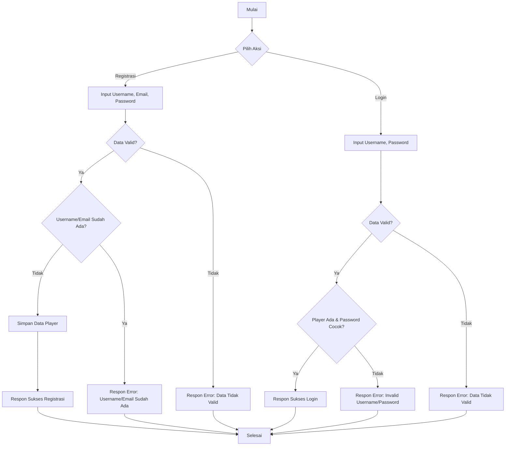
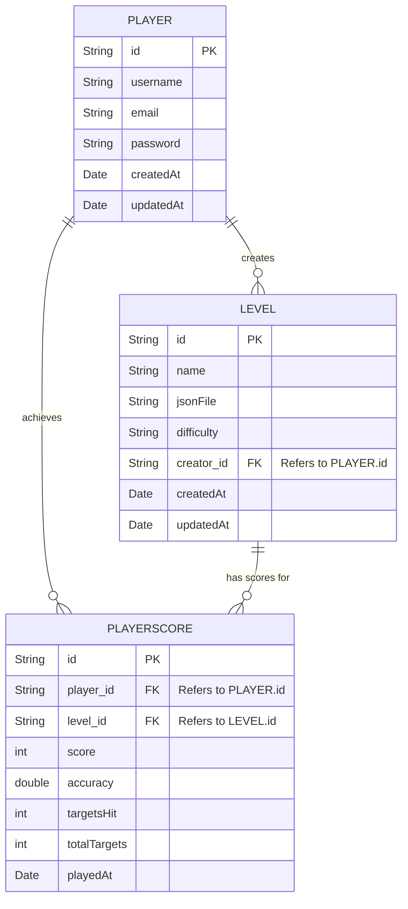

# ReAim

## Daftar Isi
- [ReAim](#reaim)
  - [Daftar Isi](#daftar-isi)
  - [Pendahuluan](#pendahuluan)
  - [Teknologi yang Digunakan](#teknologi-yang-digunakan)
  - [Struktur Proyek](#struktur-proyek)
  - [Konfigurasi](#konfigurasi)
  - [Model Data](#model-data)
    - [Player](#player)
    - [Level](#level)
    - [PlayerScore](#playerscore)
  - [API Endpoints](#api-endpoints)
    - [Autentikasi](#autentikasi)
    - [Level](#level-1)
    - [Skor Pemain](#skor-pemain)
    - [Test](#test)
  - [Diagram](#diagram)
    - [Flowchart Registrasi \& Login](#flowchart-registrasi--login)
    - [UML Class Diagram](#uml-class-diagram)
    - [ERD (Entity Relationship Diagram)](#erd-entity-relationship-diagram)
  - [Menjalankan Aplikasi](#menjalankan-aplikasi)

## Pendahuluan
ReAim adalah sebuah game yang bertujuan untuk melatih kemampuan membidik pemain. Dokumentasi ini menjelaskan arsitektur dan fungsionalitas backend dari aplikasi ReAim. Backend ini bertanggung jawab untuk mengelola data pemain, level permainan, skor, dan autentikasi.

## Teknologi yang Digunakan
- **Java 17**: Bahasa pemrograman utama.
- **Spring Boot 3.1.5**: Framework untuk membangun aplikasi.
- **Spring Data MongoDB**: Untuk interaksi dengan database MongoDB.
- **MongoDB**: Database NoSQL yang digunakan untuk menyimpan data.
- **Gradle**: Build tool untuk manajemen dependensi dan proses build.
- **Lombok**: Library untuk mengurangi boilerplate code pada model Java.

## Struktur Proyek
```
ReAim-Springboot
├── build/                     # Hasil build
├── gradle/                    # Konfigurasi Gradle Wrapper
├── src
│   ├── main
│   │   ├── java
│   │   │   └── io/github/reaim
│   │   │       ├── ReAimApplication.java  # Kelas utama Spring Boot
│   │   │       ├── config                 # Konfigurasi aplikasi (MongoConfig)
│   │   │       ├── controller             # Controller untuk API (AuthController, LevelController, PlayerScoreController, TestController)
│   │   │       ├── model                  # Model data (Player, Level, PlayerScore)
│   │   │       └── repository             # Repository untuk interaksi database (PlayerRepository, LevelRepository, PlayerScoreRepository)
│   │   └── resources
│   │       ├── application.properties     # Konfigurasi Spring Boot
│   │       └── database
│   │           └── schema.sql             # (Tidak digunakan untuk MongoDB, mungkin sisa dari setup awal)
│   └── test                               # Kode untuk testing
├── .env                       # File untuk variabel lingkungan (misalnya, koneksi DB)
├── .gitignore                 # File yang diabaikan oleh Git
├── build.gradle               # Skrip build Gradle
├── gradlew                    # Gradle Wrapper (Linux/Mac)
└── gradlew.bat                # Gradle Wrapper (Windows)
```

## Konfigurasi
Konfigurasi utama aplikasi terdapat pada file `src/main/resources/application.properties`.
```properties
# Server Port
server.port=3000 # Default port adalah 8080, diubah menjadi 3000

# MongoDB Configuration
spring.data.mongodb.uri=mongodb://localhost:27017/reaim_db # Ganti dengan URI MongoDB Anda
# spring.data.mongodb.host=localhost
# spring.data.mongodb.port=27017
# spring.data.mongodb.database=reaim_db
```
Pastikan MongoDB server berjalan dan dapat diakses sesuai dengan URI yang dikonfigurasi. Anda juga dapat menggunakan file `.env` untuk menyimpan konfigurasi sensitif dan memuatnya menggunakan library seperti `dotenv-java`.

## Model Data

### Player
Merepresentasikan pemain dalam game.
- `id` (String): ID unik pemain (otomatis oleh MongoDB).
- `username` (String): Nama pengguna unik.
- `email` (String): Alamat email unik.
- `password` (String): Kata sandi (disarankan untuk di-hash sebelum disimpan).
- `createdAt` (Date): Tanggal pembuatan akun (otomatis).
- `updatedAt` (Date): Tanggal pembaruan akun (otomatis).

### Level
Merepresentasikan level permainan.
- `id` (String): ID unik level (otomatis oleh MongoDB).
- `name` (String): Nama level.
- `jsonFile` (String): Path atau URL ke file JSON yang berisi data konfigurasi level.
- `difficulty` (String): Tingkat kesulitan level (misalnya, "Mudah", "Sedang", "Sulit").
- `creator` (Player): Pemain yang membuat level ini (referensi ke model Player).
- `createdAt` (Date): Tanggal pembuatan level (otomatis).
- `updatedAt` (Date): Tanggal pembaruan level (otomatis).

### PlayerScore
Merepresentasikan skor yang dicapai pemain pada suatu level.
- `id` (String): ID unik skor (otomatis oleh MongoDB).
- `player` (Player): Pemain yang mencapai skor (referensi ke model Player).
- `level` (Level): Level tempat skor dicapai (referensi ke model Level).
- `score` (int): Nilai skor.
- `accuracy` (double): Akurasi tembakan (misalnya, 0.85 untuk 85%).
- `targetsHit` (int): Jumlah target yang berhasil ditembak.
- `totalTargets` (int): Jumlah total target dalam level.
- `playedAt` (Date): Tanggal skor dicapai (otomatis).

## API Endpoints
Semua endpoint API berada di bawah prefix `/api`. Port default adalah `3000`.

### Autentikasi
Base URL: `/api/auth`

| Method | Endpoint          | Deskripsi                                  | Request Body (JSON)                               | Response (JSON)                                                                 |
|--------|-------------------|--------------------------------------------|---------------------------------------------------|---------------------------------------------------------------------------------|
| POST   | `/register`       | Mendaftarkan pemain baru.                  | `{ "username": "user", "email": "user@example.com", "password": "pass" }` | `{ "id": "...", "username": "...", ... }` atau pesan error                     |
| POST   | `/login`          | Login pemain.                              | `{ "username": "user", "password": "pass" }`      | `{ "message": "Login successful", "player": { ... } }` atau pesan error         |
| GET    | `/profile/{username}` | Mendapatkan profil pemain berdasarkan username. | -                                                 | `{ "id": "...", "username": "...", ... }` atau 404 Not Found                    |
| PUT    | `/profile/update` | Memperbarui profil pemain (email/password). | `{ "id": "playerId", "email": "new@example.com", "password": "newpass" }` | `{ "id": "...", "username": "...", ... }` atau 404 Not Found / pesan error |

### Level
Base URL: `/api/levels`

| Method | Endpoint                | Deskripsi                                     | Request Body (JSON)                                                                 | Response (JSON)                                                              |
|--------|-------------------------|-----------------------------------------------|-------------------------------------------------------------------------------------|------------------------------------------------------------------------------|
| POST   | `/create`               | Membuat level baru.                           | `{ "name": "Level 1", "jsonFile": "level1.json", "difficulty": "Mudah", "creator": {"id": "creatorPlayerId"} }` | `{ "id": "...", "name": "...", ... }` atau pesan error                      |
| GET    | `/`                     | Mendapatkan semua level.                      | -                                                                                   | `[ { "id": "...", "name": "...", ... }, ... ]`                               |
| GET    | `/{id}`                 | Mendapatkan detail level berdasarkan ID.      | -                                                                                   | `{ "id": "...", "name": "...", ... }` atau 404 Not Found                     |
| GET    | `/creator/{creatorId}`  | Mendapatkan level berdasarkan ID pembuat.     | -                                                                                   | `[ { "id": "...", "name": "...", ... }, ... ]` atau 404 Not Found             |
| GET    | `/difficulty/{difficulty}` | Mendapatkan level berdasarkan tingkat kesulitan. | -                                                                                   | `[ { "id": "...", "name": "...", ... }, ... ]`                               |
| PUT    | `/{id}`                 | Memperbarui detail level.                     | `{ "name": "Updated Name", "jsonFile": "updated.json", "difficulty": "Sedang" }`    | `{ "id": "...", "name": "...", ... }` atau 404 Not Found / pesan error      |
| DELETE | `/{id}`                 | Menghapus level.                              | -                                                                                   | `{ "message": "Level deleted successfully" }` atau 404 Not Found / pesan error |

### Skor Pemain
Base URL: `/api/scores`

| Method | Endpoint                             | Deskripsi                                          | Request Body (JSON)                                                                                                | Response (JSON)                                                                 |
|--------|--------------------------------------|----------------------------------------------------|--------------------------------------------------------------------------------------------------------------------|---------------------------------------------------------------------------------|
| POST   | `/submit`                            | Mengirimkan skor baru.                             | `{ "player": {"id": "playerId"}, "level": {"id": "levelId"}, "score": 1500, "accuracy": 0.9, "targetsHit": 9, "totalTargets": 10 }` | `{ "id": "...", "player": {...}, ... }` atau pesan error                       |
| GET    | `/player/{playerId}`                 | Mendapatkan semua skor pemain berdasarkan ID pemain. | -                                                                                                                  | `[ { "id": "...", "score": ..., ... }, ... ]` atau 404 Not Found                |
| GET    | `/level/{levelId}`                   | Mendapatkan semua skor untuk level tertentu.       | -                                                                                                                  | `[ { "id": "...", "score": ..., ... }, ... ]` atau 404 Not Found                |
| GET    | `/leaderboard/{levelId}`             | Mendapatkan papan peringkat untuk level tertentu.    | -                                                                                                                  | `[ { "id": "...", "score": ..., ... }, ... ]` (terurut berdasarkan skor tertinggi) |
| GET    | `/player/{playerId}/level/{levelId}` | Mendapatkan skor pemain untuk level tertentu.      | -                                                                                                                  | `[ { "id": "...", "score": ..., ... }, ... ]` atau 404 Not Found                |
| DELETE | `/{id}`                              | Menghapus skor berdasarkan ID skor.                | -                                                                                                                  | `{ "message": "Score deleted successfully" }` atau 404 Not Found / pesan error  |

### Test
Base URL: `/` (root)

| Method | Endpoint | Deskripsi                               | Request Body | Response      |
|--------|----------|-----------------------------------------|--------------|---------------|
| GET    | `/`      | Endpoint tes untuk mengecek server aktif. | -            | "Test successful" |

## Diagram

### Flowchart Registrasi & Login


### UML Class Diagram


### ERD (Entity Relationship Diagram)
Karena menggunakan MongoDB (NoSQL), ERD tradisional kurang relevan. Namun, kita bisa menggambarkan relasi antar koleksi (collections).


*Catatan: Pada MongoDB, referensi antar dokumen biasanya disimpan sebagai ID dari dokumen yang direferensikan, atau dokumen bisa di-embed.*

## Menjalankan Aplikasi
1. Pastikan Java 17 dan Gradle terinstal.
2. Pastikan MongoDB server berjalan dan dapat diakses.
3. Konfigurasi koneksi MongoDB pada `src/main/resources/application.properties` atau melalui file `.env`.
4. Buka terminal di direktori `ReAim-Springboot`.
5. Jalankan perintah: `./gradlew bootRun` (untuk Linux/Mac) atau `gradlew.bat bootRun` (untuk Windows).
6. Aplikasi akan berjalan pada port yang dikonfigurasi (default 3000).

Untuk menghentikan aplikasi, tekan `Ctrl+C` di terminal.
