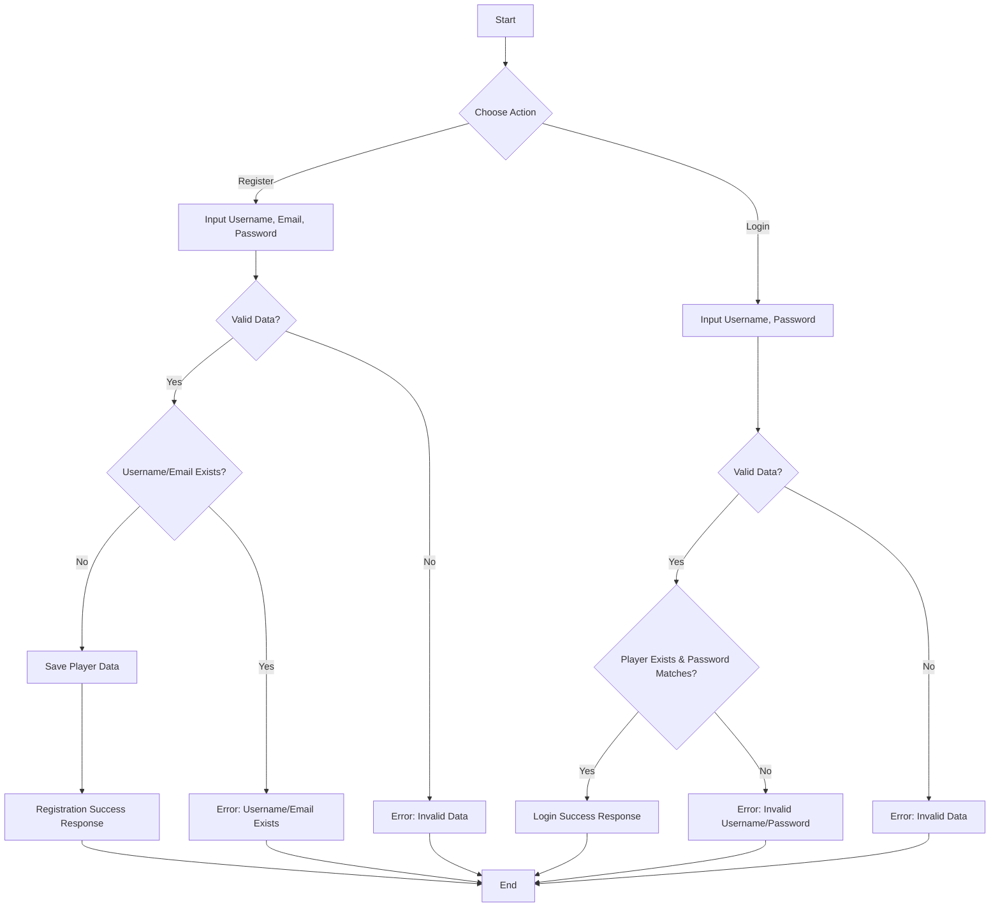
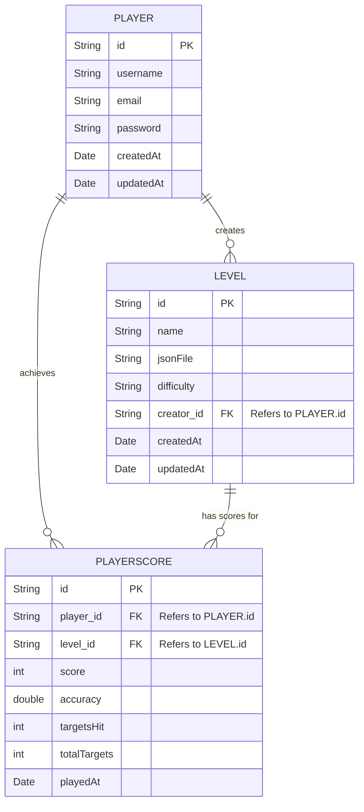

# ReAim: Rhythm & Aim Trainer

ReAim is a game designed to sharpen your aiming skills through rhythm-based challenges. This document provides a comprehensive guide to understanding the architecture and functionality of both the backend and frontend components of ReAim.

## Table of Contents

- [ReAim: Rhythm \& Aim Trainer](#reaim-rhythm--aim-trainer)
  - [Table of Contents](#table-of-contents)
  - [Features](#features)
  - [Technologies Used](#technologies-used)
    - [Backend](#backend)
    - [Frontend](#frontend)
  - [Project Structure](#project-structure)
    - [Backend (ReAim-Springboot)](#backend-reaim-springboot)
    - [Frontend (ReAim-Frontend)](#frontend-reaim-frontend)
  - [Setup and Running](#setup-and-running)
    - [Backend Setup](#backend-setup)
    - [Frontend Setup](#frontend-setup)
  - [Backend Details](#backend-details)
    - [Configuration (Backend)](#configuration-backend)
    - [Data Models (Backend)](#data-models-backend)
    - [API Endpoints](#api-endpoints)
      - [Authentication (`/api/auth`)](#authentication-apiauth)
      - [Level (`/api/levels`)](#level-apilevels)
      - [Player Score (`/api/scores`)](#player-score-apiscores)
      - [Test (`/`)](#test-)
    - [Diagrams (Backend)](#diagrams-backend)
      - [Flowchart: Registration \& Login](#flowchart-registration--login)
      - [UML Class Diagram](#uml-class-diagram)
      - [ERD (Entity Relationship Diagram - Conceptual for NoSQL)](#erd-entity-relationship-diagram---conceptual-for-nosql)
  - [Frontend Details](#frontend-details)
    - [Core Components (Frontend)](#core-components-frontend)
    - [Asset Management (Frontend)](#asset-management-frontend)
    - [Game Flow (Frontend)](#game-flow-frontend)
  - [Automatic Music Analysis](#automatic-music-analysis)

## Features

-   **Rhythm-Based Gameplay**: Engage in levels where aiming challenges are synchronized with music.
-   **User Authentication**: Secure registration and login system for players.
-   **Level Management**: Create, share, and play various game levels.
-   **Scoring System**: Track player scores, accuracy, and performance on leaderboards.
-   **Customizable Experience**: (Details about crosshairs, guns, etc. can be added here)
-   **Automatic Music Analysis**: Automatically generate game maps from MP3 files. Simply add an MP3 file to the `ReAim-Frontend/assets/MUSIC/` directory, and the game will process it to create a new playable map.

## Technologies Used

### Backend
-   **Java 17**: Primary programming language.
-   **Spring Boot 3.1.5**: Framework for microservices.
-   **Spring Data MongoDB**: For NoSQL database interaction.
-   **MongoDB**: NoSQL database for data storage.
-   **Gradle**: Dependency management and build tool.
-   **Lombok**: Reduces boilerplate code.

### Frontend
-   **Java 8+**: Compatible Java version for LibGDX.
-   **LibGDX**: Cross-platform game development framework.
-   **Gradle**: Build tool for dependency management.

## Project Structure

### Backend (ReAim-Springboot)
The backend handles player data, levels, scores, and authentication.

```
ReAim-Springboot
├── build/                 # Build outputs
├── gradle/                # Gradle Wrapper configuration
├── src
│   ├── main
│   │   ├── java
│   │   │   └── io/github/reaim
│   │   │       ├── ReAimApplication.java # Main Spring Boot application class
│   │   │       ├── config              # Application configurations (e.g., MongoConfig)
│   │   │       ├── controller          # API controllers (AuthController, LevelController, etc.)
│   │   │       ├── model               # Data models (Player, Level, PlayerScore)
│   │   │       └── repository          # Database interaction interfaces
│   │   └── resources
│   │       ├── application.properties  # Core Spring Boot configuration
│   │       └── database
│   │           └── schema.sql          # (Not used for MongoDB)
│   └── test                            # Unit and integration tests
├── .env                   # Environment variables (e.g., DB connection)
├── .gitignore             # Git ignore file
├── build.gradle           # Gradle build script
├── gradlew                # Gradle Wrapper (Linux/Mac)
└── gradlew.bat            # Gradle Wrapper (Windows)
```

### Frontend (ReAim-Frontend)
The frontend provides the visual interface and game interaction.

```
ReAim-Frontend
├── core/                   # Core game logic (platform-agnostic)
│   ├── src/main/java/io/github/some_example_name/
│   │   ├── Main.java         # LibGDX application entry point
│   │   ├── screens/          # Game screens (Login, MainMenu, GameScreen)
│   │   ├── models/           # Game entities (Player, Target, Gun)
│   │   └── managers/         # Game managers (LevelManager, GameAssets)
│   └── assets/ (located at ReAim-Frontend/assets/) # Game assets (images, sounds, music)
├── lwjgl3/                 # Desktop launcher (LWJGL3)
├── html/                   # HTML5/GWT launcher (for browser play)
├── build.gradle            # Root Gradle build script for frontend modules
├── gradlew                 # Gradle Wrapper (Linux/Mac)
└── gradlew.bat             # Gradle Wrapper (Windows)
```

## Setup and Running

### Backend Setup
1.  Ensure **Java 17** and **Gradle** are installed.
2.  Ensure **MongoDB** server is running and accessible.
3.  Configure MongoDB connection in `ReAim-Springboot/src/main/resources/application.properties` or via `.env` file.
    ```properties
    # Server Port
    server.port=3000

    # MongoDB Configuration
    spring.data.mongodb.uri=mongodb://localhost:27017/reaim_db
    ```
4.  Open a terminal in the `ReAim-Springboot` directory.
5.  Run:
    -   Linux/Mac: `./gradlew bootRun`
    -   Windows: `gradlew.bat bootRun`
6.  The backend will run on the configured port (default: `3000`).

### Frontend Setup
1.  Ensure **Java Development Kit (JDK 8+)** is installed.
2.  Open a terminal in the `ReAim-Frontend` directory.
3.  Run for desktop:
    ```bash
    ./gradlew lwjgl3:run
    ```
4.  (Optional) For HTML5 version (if configured):
    -   Development: `./gradlew html:superDev`
    -   Distribution: `./gradlew html:dist`

## Backend Details

### Configuration (Backend)
Main configuration is in `src/main/resources/application.properties`.
Sensitive configurations can be managed using an `.env` file.

### Data Models (Backend)

-   **Player**: User information (`id`, `username`, `email`, `password`, `createdAt`, `updatedAt`).
-   **Level**: Game level details (`id`, `name`, `jsonFile`, `difficulty`, `creator` (Player ref), `createdAt`, `updatedAt`).
-   **PlayerScore**: Player's score on a level (`id`, `player` (Player ref), `level` (Level ref), `score`, `accuracy`, `targetsHit`, `totalTargets`, `playedAt`).

### API Endpoints
All endpoints are prefixed with `/api` and run on port `3000` by default.

#### Authentication (`/api/auth`)
| Method | Endpoint              | Description                                 | Request Body (JSON)                                            |
|--------|-----------------------|-------------------------------------------|----------------------------------------------------------------|
| `POST` | `/register`           | Register a new player.                    | `{ "username": "user", "email": "user@example.com", "password": "pass" }` |
| `POST` | `/login`              | Login a player.                           | `{ "username": "user", "password": "pass" }`                   |
| `GET`  | `/profile/{username}` | Get player profile by username.           | -                                                              |
| `PUT`  | `/profile/update`     | Update player profile (email/password).   | `{ "id": "playerId", "email": "new@example.com", "password": "newpass" }` |

#### Level (`/api/levels`)
| Method | Endpoint                   | Description                                   | Request Body (JSON)                                                                |
|--------|----------------------------|---------------------------------------------|------------------------------------------------------------------------------------|
| `POST` | `/create`                  | Create a new level.                         | `{ "name": "Level 1", "jsonFile": "level1.json", "difficulty": "Mudah", "creator": {"id": "creatorPlayerId"} }` |
| `GET`  | `/`                        | Get all levels.                             | -                                                                                  |
| `GET`  | `/{id}`                    | Get level details by ID.                    | -                                                                                  |
| `GET`  | `/creator/{creatorId}`     | Get levels by creator ID.                   | -                                                                                  |
| `GET`  | `/difficulty/{difficulty}` | Get levels by difficulty.                   | -                                                                                  |
| `PUT`  | `/{id}`                    | Update level details.                       | `{ "name": "Updated Name", "jsonFile": "updated.json", "difficulty": "Sedang" }` |
| `DELETE`| `/{id}`                    | Delete a level.                             | -                                                                                  |

#### Player Score (`/api/scores`)
| Method | Endpoint                             | Description                                       | Request Body (JSON)                                                                                                    |
|--------|--------------------------------------|-------------------------------------------------|------------------------------------------------------------------------------------------------------------------------|
| `POST` | `/submit`                            | Submit a new score.                             | `{ "player": {"id": "playerId"}, "level": {"id": "levelId"}, "score": 1500, "accuracy": 0.9, "targetsHit": 9, "totalTargets": 10 }` |
| `GET`  | `/player/{playerId}`                 | Get all scores for a player by player ID.       | -                                                                                                                      |
| `GET`  | `/level/{levelId}`                   | Get all scores for a specific level.            | -                                                                                                                      |
| `GET`  | `/leaderboard/{levelId}`             | Get leaderboard for a specific level.           | -                                                                                                                      |
| `GET`  | `/player/{playerId}/level/{levelId}` | Get player's scores for a specific level.       | -                                                                                                                      |
| `DELETE`| `/{id}`                              | Delete a score by score ID.                     | -                                                                                                                      |

#### Test (`/`)
| Method | Endpoint | Description                            |
|--------|----------|--------------------------------------|
| `GET`  | `/`      | Test endpoint to check server status.  |

### Diagrams (Backend)

#### Flowchart: Registration & Login


#### UML Class Diagram


#### ERD (Entity Relationship Diagram - Conceptual for NoSQL)

*Note: In MongoDB, relationships are typically managed via referenced IDs or embedded documents.*

## Frontend Details

### Core Components (Frontend)
-   **`Main.java`**: LibGDX application entry point. Initializes and sets the first screen.
-   **Screens**:
    -   `LoginRegisterScreen`: Handles player login and registration via backend API.
    -   `MainMenuScreen`: Post-login screen for game navigation.
    -   `GameScreen`: Core gameplay screen managing targets, gun, crosshair, and scoring.
-   **Models**:
    -   `Player.java` (Frontend): Stores relevant player data client-side.
    -   `Target.java`: Represents shootable targets, manages position and hit detection.
    -   `Gun.java`: Represents the player's weapon.
    -   `Crosshair.java`: Represents the player's aiming reticle.
-   **Managers**:
    -   `LevelManager.java`: Loads level configurations (from `assets/MUSIC/levels/levels.json`), manages background music, and handles target spawning based on music analysis.
    -   `GameAssets.java`: Singleton for loading and managing game assets (textures, sounds, music) using LibGDX `AssetManager`.

### Asset Management (Frontend)
All game assets (images, sounds, music, fonts, level JSONs) are stored in `ReAim-Frontend/assets/`. The `GameAssets.java` class uses LibGDX's `AssetManager` for efficient loading and access.

### Game Flow (Frontend)
1.  **Start**: Player launches the game, `LoginRegisterScreen` appears.
2.  **Authentication**: Player logs in or registers; data is sent to the backend.
3.  **Main Menu**: Successful authentication leads to `MainMenuScreen`.
4.  **Start Game**: Player selects a level from `MainMenuScreen` (or `LevelSelectScreen`).
5.  **Gameplay**: `GameScreen` initializes. `LevelManager` loads the selected level.
6.  **Interaction**: Player aims and shoots targets.
7.  **Scoring**: Score is tracked. Upon level completion, the final score is sent to the backend.
8.  **Post-Game**: Player can return to the main menu or view results.

## Automatic Music Analysis

ReAim features an innovative system to automatically generate game maps from your MP3 files.

**How it works:**
1.  Simply place any MP3 file into the `ReAim-Frontend/assets/MUSIC/` directory.
2.  The game utilizes a Python script, `ReAim-Frontend/assets/MUSIC/ANALYZE.py`, to process the audio. This script analyzes the music to identify beats, rhythm changes, or other significant audio events.
3.  Based on this analysis, a new game map (typically a JSON configuration file, e.g., `YourSong_analysis.json`) is generated and saved within the `ReAim-Frontend/assets/MUSIC/` directory or a sub-directory like `ReAim-Frontend/assets/MUSIC/levels/`.
4.  This newly generated map then becomes available in the game for players to select and play.

**Requirements for `ANALYZE.py`:**
-   **Python Installation**: Ensure Python is installed on the system where the game (specifically the analysis part) is intended to run or where new maps are generated.
-   **Dependencies**: The `ANALYZE.py` script may require specific Python libraries for audio processing (e.g., `librosa`, `numpy`). These would need to be installed in your Python environment.
    ```bash
    pip install librosa numpy
    ```
    (List any other specific dependencies here if known).

This feature allows for an ever-expanding library of levels, limited only by your music collection!
